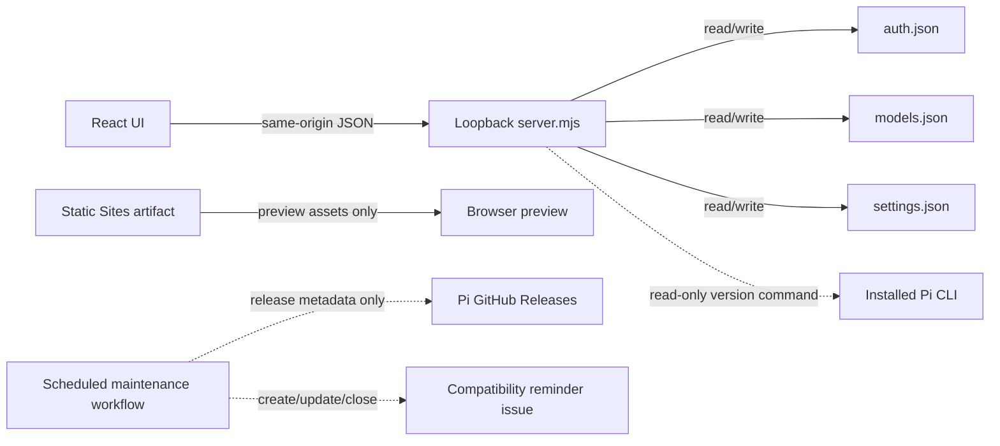

# Project Architecture

## Product boundary

Pi Provider Manager is a local editor for Pi's native provider, model, credential, and runtime-default configuration. Pi remains the runtime and its JSON files remain the source of truth.

The project does not:

- proxy model traffic or sit between Pi and a provider
- replace Pi's model selector, session state, or runtime
- copy Pi source code or depend on a Pi package at runtime
- discover remote model catalogs without an explicit future feature and user consent
- expose the local management API beyond loopback

## Runtime shapes

There are three deliberately separate execution paths:

1. The shipped local product serves the built UI and API from one `127.0.0.1` process. This is the only shape that writes Pi configuration.
2. Vite development runs the UI and API as two processes with a local proxy. It is useful for development, but it is not sufficient evidence for production headers or server behavior.
3. The Sites artifact is a static preview/handoff package. Its Worker only serves assets and an HTML fallback; it has no access to local Pi files and is not a hosted replacement for the local product.

The Pi update monitor is repository maintenance automation, not a fourth product runtime.

## Component map

| Path | Responsibility | Explicitly does not own |
| --- | --- | --- |
| `src/` | React workflow, validation feedback, demo fixture, theme, and save handoff | filesystem access, stored credentials, provider traffic |
| `server.mjs` | loopback API, Pi version detection, config validation, atomic writes, rollback, static production serving | remote provider requests, model execution, update monitoring |
| `bin/pi-provider-manager-ui` | WSL/local process discovery, port selection, detached launch, browser opening | configuration schema or UI state |
| `scripts/dev.mjs` | paired Vite and API development processes | production verification |
| `worker/index.js` | static asset and app-route fallback for Sites packaging | `/api` implementation or Pi config access |
| `scripts/check-pi-update.mjs` | compare the declared compatibility baseline with the latest stable Pi release and maintain one reminder issue | application startup, builds, Pi installation, automatic baseline changes |
| `tests/` | API/security boundary, Sites packaging, and update-monitor behavior | live provider credentials or private fixtures |
| `design-qa.md`, `qa/` | accepted visual and interaction evidence | current runtime state |

## Configuration ownership

| File | Access | Manager-owned behavior |
| --- | --- | --- |
| `auth.json` | read/write | stores new or migrated provider credentials; existing values never enter browser responses |
| `models.json` | read/write | edits providers, models, protocol selection, and known compatibility fields while preserving unknown fields |
| `settings.json` | read/write | edits `defaultProvider`, `defaultModel`, `defaultThinkingLevel`, `hideThinkingBlock`, and `transport`; preserves other keys |
| `models-store.json` | none | intentionally never modified |

Provider saves snapshot all three writable files, validate temporary JSON, replace files with private permissions where supported, and restore the snapshots if any write fails. Settings-only saves use the same validated atomic write primitive for `settings.json`.

## Security boundary

The browser can send credentials during a save, so the local API is a security boundary even though it listens only on loopback.

Required invariants:

- bind only to `127.0.0.1`
- allow only the expected loopback `Host` values to defeat DNS rebinding
- require `application/json` for writes so cross-origin simple requests cannot mutate state
- never serialize an existing credential to the browser
- cap request bodies and validate provider IDs, URLs, protocols, models, and settings
- serve the pre-paint theme script under a hash-based CSP in production

Changes to these rules require exercising real requests against `PI_PROVIDER_MANAGER_SERVE_UI=1 node server.mjs`; source inspection and Vite-only checks are not sufficient.

## Compatibility isolation

The only product-level compatibility input is `piValidatedVersion` in `package.json`. Vite injects it into the non-writing demo fixture, and the server reports it beside the locally detected `pi --version`; neither path downloads Pi metadata or decides compatibility at runtime.

The scheduled monitor lives under `.github/workflows/` and reads the public `earendil-works/pi` latest stable GitHub Release. A newer release creates or refreshes a maintenance issue. It never changes code, installs Pi, updates `piValidatedVersion`, or claims the new release is compatible. See [compatibility.md](compatibility.md) for the triage and validation policy.

## Verification matrix

| Change | Minimum evidence |
| --- | --- |
| Docs or repository metadata only | relevant parser/schema checks and `git diff --check` |
| Update monitor | `npm run test:pi-update`; optionally `npm run check:pi-update` for a live read-only comparison |
| Server or API | `npm run test:server` plus a production-shape request against `server.mjs` |
| UI behavior or styling | production build, browser flow, console/page errors, responsive checks, and production-shape serving |
| Sites packaging | `npm run build` and `npm run test:sites` |
| Pi schema compatibility | the complete checklist in [compatibility.md](compatibility.md) with a real released Pi build |

All changes land through a branch and pull request. The protected `main` branch requires the stable aggregate `ci-passed` check and linear history.
