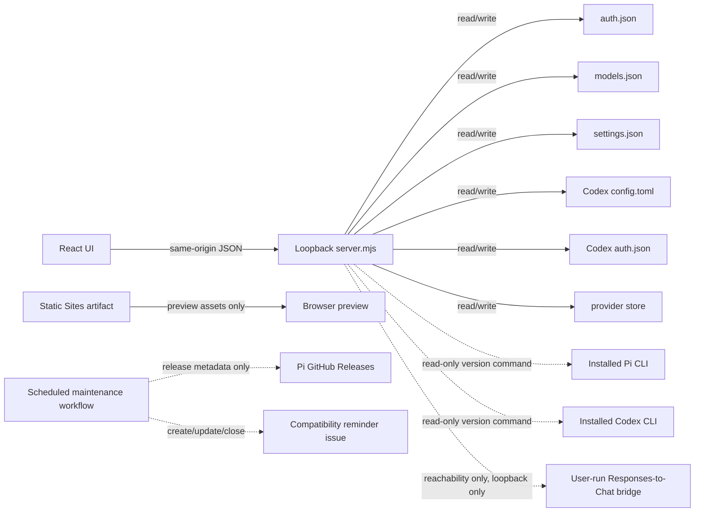

# Project Architecture

## Product boundary

Pi Provider Manager is a local editor for the native provider, model, credential, runtime-default, and global-instruction configuration of two coding agents: Pi and the Codex CLI. Each agent remains the runtime, and its own config files remain the source of truth.

The project does not:

- proxy model traffic or sit between Pi and a provider
- replace Pi's model selector, session state, or runtime
- copy Pi source code or depend on a Pi package at runtime
- discover remote model catalogs without an explicit future feature and user consent
- expose the local management API beyond loopback

## Vocabulary

- **Provider / API gateway**: one entry under `models.json.providers`. It owns one Base URL, one credential, and one default wire protocol, and it may expose models from several upstream model families. In this project, "provider" does not necessarily mean one model vendor.
- **Model**: a provider-scoped model ID. Pi selects it at runtime as `provider/model`; thinking level remains a separate setting or command suffix.
- **API / wire protocol**: one of Pi's supported protocol identifiers, currently `openai-responses`, `openai-completions`, `anthropic-messages`, or `google-generative-ai`. A provider sets the default and a model may override it.
- **Target**: which agent a screen is editing, `pi` or `codex`. The two share the shell — sidebar, three-step wizard, settings screen — and nothing else; they have separate files, separate revisions, and separate vocabulary.
- **Owned provider table**: the single `[model_providers.<id>]` in Codex's `config.toml` that this manager writes, `custom` by default. Codex's other provider tables belong to the user and are never read, written, or deleted.
- **Provider store**: `pi-provider-manager-store.json`, this manager's own file inside the Codex directory. It holds every Codex provider's definition and key. See "The Codex exception" below for why it exists.
- **Bridge**: a LiteLLM proxy that translates Codex's Responses requests into an upstream that exposes only `/v1/chat/completions`. The manager writes its config, points the Codex provider at it, and starts and stops the process; the user installs LiteLLM. The manager never carries model traffic itself.
- **Validated Pi version**: the release in `package.json.piValidatedVersion` that completed the compatibility checklist. It is not the same as the Pi version detected on a user's machine.
- **Latest release versus `main`**: GitHub tags and Releases define what has shipped. `main` may contain additional work under `CHANGELOG.md`'s `Unreleased` section even while `package.json.version` still matches the latest release.

## Runtime shapes



There are three deliberately separate execution paths:

1. The shipped local product runs `server.mjs` with `PI_PROVIDER_MANAGER_SERVE_UI=1`, serving the built UI and API from one `127.0.0.1` process.
2. Vite development runs the same writable `server.mjs` API beside the Vite UI, with a local proxy between them. Use a temporary `PI_CODING_AGENT_DIR`; this path is useful for development but is not sufficient evidence for production headers or static serving.
3. The Sites artifact is a static preview/handoff package. Its Worker only serves assets and an HTML fallback; it has no access to local Pi files and is not a hosted replacement for the local product.

Only `server.mjs` writes Pi or Codex configuration, in the first two paths. The dotted edges are read-only: version commands and a bridge reachability probe. No model traffic passes through this process for either agent. Demo mode and the Sites artifact never write it. The Pi update monitor is repository maintenance automation, not a fourth product runtime.

## Component map

| Path | Responsibility | Explicitly does not own |
| --- | --- | --- |
| `src/` | React workflow, validation feedback, demo fixture, theme, and save handoff | filesystem access, stored credentials, provider traffic |
| `lib/` | dependency-free server modules shipped as source: atomic writes, the shared managed-file guard, TOML document model, Codex config, LiteLLM bridge, prompt library, Pi and Codex version detection, this project's own update lookup and upgrade | HTTP, routing, UI state |
| `server.mjs` | loopback API, config validation, revision checks, atomic writes, rollback, static production serving, replacing itself on restart | remote provider requests, model execution, update monitoring |
| `bin/pi-provider-manager-ui` | WSL/local process discovery, port selection, detached launch, browser opening | configuration schema or UI state |
| `scripts/dev.mjs` | paired Vite and API development processes | production verification |
| `worker/index.js` | static asset and app-route fallback for Sites packaging | `/api` implementation or Pi config access |
| `scripts/check-pi-update.mjs` | compare the declared compatibility baseline with the latest stable Pi release and maintain one reminder issue | application startup, builds, Pi installation, automatic baseline changes |
| `tests/` | API/security boundary, Sites packaging, and update-monitor behavior | live provider credentials or private fixtures |
| `design-qa.md`, `qa/` | accepted visual and interaction evidence | current runtime state |

## Configuration ownership

| File | Access | Manager-owned behavior |
| --- | --- | --- |
| `auth.json` | read/write | stores new or migrated provider credentials; existing values never enter browser responses |
| `models.json` | read/write | edits providers, models, protocol selection, and known compatibility fields while preserving unknown fields |
| `settings.json` | read/write | edits `defaultProvider`, `defaultModel`, `defaultThinkingLevel`, `hideThinkingBlock`, and `transport`; preserves other keys |
| `models-store.json` | none | intentionally never read or written |
| `$CODEX_HOME/config.toml` | read/write | the owned `[model_providers.<id>]` and the top-level `model`, `model_provider`, `model_reasoning_effort`, `plan_mode_reasoning_effort`, `model_verbosity`, `model_context_window`; every other key, comment, and hand-written provider table is preserved byte for byte. Also removes `[profiles.*]` tables recorded as generated by 0.2.0/0.2.1, which current Codex rejects |
| `~/.pi/agent/AGENTS.md`, `SYSTEM.md`, `APPEND_SYSTEM.md` | read/write | whole-file: each holds the one prompt document currently active. Alternatives live in `pi-provider-manager-prompts.json` |
| `$CODEX_HOME/AGENTS.md` | read/write | same, for Codex |
| `<config dir>/pi-provider-manager-prompts.json` | read/write | this manager's own prompt library, `0600`, one per agent directory |
| `$CODEX_HOME/auth.json` | read/write | `auth_mode` and `OPENAI_API_KEY` for the active provider only; other keys, including a ChatGPT login's `tokens`, are preserved, and a provider with `requires_openai_auth = false` does not touch the file at all |
| `$CODEX_HOME/pi-provider-manager-store.json` | read/write | this manager's own provider store, `0600` |

Provider saves and deletions snapshot all three writable files, validate temporary JSON, replace files with private permissions where supported, and restore the snapshots if any write fails. Every state response also carries an opaque HMAC revision over the raw contents of the three files. Provider, provider-delete, and settings writes must echo that revision; a mismatch returns HTTP 409 before any write, so a stale browser tab cannot overwrite a change made by CC Switch, another manager process, or a text editor. The HMAC key is process-local and never exposes a hash that can be tested against a stored credential. Deleting a provider removes its credential by default, may retain it as an auth-only entry for later reuse, and requires a valid replacement provider/model when the target is Pi's current default. Auth-only entries remain available as credential sources but are not rendered as model providers. Settings-only saves use the same validated atomic write primitive for `settings.json`.


### The Codex exception to "the config file is the source of truth"

For Pi, the three JSON files are the whole truth and this manager stores nothing of its own. Codex cannot work that way, and the difference is deliberate rather than accidental:

- Codex has exactly one credential slot (`auth.json` → `OPENAI_API_KEY`).
- This project writes exactly one `[model_providers.<id>]` table, so `config.toml` describes only the provider currently in use — that is what makes the file match, line for line, the snippet a vendor publishes.

Together those mean a second provider's base URL, model list, and key have nowhere to live in Codex's own files. They live in `pi-provider-manager-store.json` instead. So: **`config.toml` remains the truth for what Codex will actually do; the store is the truth for what else you have configured.**

Two rules keep that from becoming a database that quietly diverges from disk:

1. **The file wins.** If the owned table on disk matches no stored provider, it is adopted as one and shown as active. The UI says it was adopted rather than letting an entry appear from nowhere.
2. **Reading never writes.** Adoption is derived on the read path. Opening the page leaves every file untouched; only an explicit save, switch, or delete writes.

Codex writes are transactional across all three files with the same snapshot-and-restore primitive as the Pi side, and carry their own revision — `state.codex.revision`, distinct from `state.revision` — so editing one agent's config cannot invalidate an in-flight draft for the other.

The manager never proxies model traffic, for Codex no less than for Pi. An upstream that speaks only Chat Completions is reached through a LiteLLM proxy: the manager generates `pi-provider-manager-litellm.yaml`, points the Codex provider at `127.0.0.1`, and supervises the process, but no request passes through this server. Writing a third-party config file and starting a process is the same kind of work the manager already does; implementing the translation would not be, and would tie the project to Codex's release cadence.

Three rules hold that supervision honest. The proxy is pinned to `127.0.0.1`, because LiteLLM defaults to `0.0.0.0` and would otherwise publish an unauthenticated proxy holding the upstream key on every interface. It is started detached, so closing the manager does not cut Codex off mid-session. And a recorded process id is never signalled unless it is still provably ours — this process spawned it and has not seen it exit, or procfs shows it running the manager's own config file — since process ids are reused. The spawn record is there because the command-line proof has a window where it cannot answer: for a moment after `spawn` returns, `/proc/<pid>/cmdline` reads empty, and treating that as "not ours" would start a second proxy over the bridge that is coming up. Seen from another manager process the same pid is nameless without being ours to claim, so an empty command line is waited out briefly and then reported as unknown — which refuses, where "not ours" would have overwritten. Bridge runtime state lives outside the config revision, so starting or stopping the proxy cannot invalidate a draft.

`POST /api/codex/bridge-check` reports whether something is answering on a loopback port and refuses any host that is not loopback, so the endpoint cannot be borrowed as a probe by a page the browser happens to be visiting.

### Reproduce retained-credential deletion

Use a temporary `PI_CODING_AGENT_DIR` with a non-default provider that has one model and an `auth.json` entry. First read `/api/state` and carry its opaque `revision` into the write; the revision is intentionally not derived in the client and must not be invented. Against the production-shaped server, send:

```http
POST /api/providers/delete
Content-Type: application/json

{
  "providerId": "repro-router",
  "keepCredential": true,
  "revision": "<revision from /api/state>"
}
```

The response state must omit `repro-router` from `providers` while retaining it in `authProviders`. On disk, `models.json.providers["repro-router"]` is gone and `auth.json["repro-router"]` remains; the credential value is never in the response. Recreate the same gateway without sending a key:

```http
POST /api/providers
Content-Type: application/json

{
  "providerId": "repro-router",
  "revision": "<new revision from /api/state>",
  "baseUrl": "https://reconfigured.example/v1",
  "api": "openai-completions",
  "credential": { "mode": "keep" },
  "models": [{
    "id": "reconfigured/model",
    "contextWindow": 128000,
    "maxTokens": 16000,
    "reasoning": true,
    "maximumThinking": "high"
  }],
  "setDefault": false
}
```

The save succeeds and reuses the retained credential. The canonical automated reproduction is `deletes providers transactionally and can retain credentials` in `tests/server.test.mjs`; the production-browser path is covered by `npm run test:ui`.

## Security boundary

The browser can send credentials during a save, so the local API is a security boundary even though it listens only on loopback.

Required invariants:

- bind only to `127.0.0.1`
- allow only the expected loopback `Host` values to defeat DNS rebinding
- require `application/json` for writes so cross-origin simple requests cannot mutate state
- do not enable CORS or answer cross-origin preflight without redesigning the authorization boundary
- never serialize an existing credential to the browser
- cap request bodies and validate provider IDs, URLs, protocols, models, and settings
- serve the pre-paint theme script under a hash-based CSP in production

Changes to these rules require exercising real requests against `PI_PROVIDER_MANAGER_SERVE_UI=1 node server.mjs`; source inspection and Vite-only checks are not sufficient. A revision conflict must be tested by changing a managed file outside the server between the state read and the write, then checking that the response is 409 and the external bytes remain intact.

## Compatibility isolation

The only product-level compatibility input is `piValidatedVersion` in `package.json`. Vite injects it into the non-writing demo fixture, and the server reports it beside the locally detected `pi --version`; neither path downloads Pi metadata or decides compatibility at runtime.

The scheduled monitor lives under `.github/workflows/` and reads the public `earendil-works/pi` latest stable GitHub Release. A newer release creates or refreshes a maintenance issue. It never changes code, installs Pi, updates `piValidatedVersion`, or claims the new release is compatible. See [compatibility.md](compatibility.md) for the triage and validation policy.

## Documentation sources of truth

| Question | Source of truth |
| --- | --- |
| Manager version reported by a build | `package.json.version` |
| Pi compatibility baseline | `package.json.piValidatedVersion` |
| Shipped versions | Git tags and GitHub Releases; `CHANGELOG.md` records release history and pending `Unreleased` work |
| Pi file schema and write behavior | `server.mjs`, guarded by `tests/server.test.mjs` |
| Product runtime and security ownership | this document and `SECURITY.md`, checked against the server tests |
| Pi update triage and validation steps | `docs/compatibility.md` |
| Historical visual and compatibility evidence | dated entries in `design-qa.md`; they are evidence, not live runtime state |
| How to install, operate, and troubleshoot the product | `docs/usage.zh-CN.md`, written for users rather than maintainers; it ships inside release archives |
| Publication tasks still open | `OPEN_SOURCE_CHECKLIST.md` |

Do not create another live copy of the app version, validated Pi version, or open-item count. Release notes and dated QA evidence may quote the values they actually tested; current documentation should point to the source above.

## Verification matrix

| Change | Minimum evidence |
| --- | --- |
| Docs or repository metadata only | relevant parser/schema checks and `git diff --check` |
| Update monitor | `npm run test:pi-update`; optionally `npm run check:pi-update` for a live read-only comparison |
| Server or API | `npm run test:server` plus a production-shape request against `server.mjs` |
| The update check or upgrade | `npm run test:server` (`tests/self-update.test.mjs` against injected commands and responses — no test reaches the network, for the same reason the product does not on startup) plus one manual `POST /api/update/check` against the real API |
| The restart handover | `npm run test:server` covers both outcomes — a replacement that takes the port, and one that cannot start and has to hand it back — and `npm run test:ui` drives the button in a browser |
| UI behavior or styling | production build, browser flow, console/page errors, responsive checks, and production-shape serving |
| Sites packaging | `npm run build` and `npm run test:sites` |
| Release packaging or launchers | `npm run build`, `npm run test:release`, `npm run test:launcher`, a Linux/WSL archive listing, and the CI job that runs the Windows launcher — parsing it is not running it |
| Pi schema compatibility | the complete checklist in [compatibility.md](compatibility.md) with a real released Pi build |

All changes land through a branch and pull request. The protected `main` branch requires the stable aggregate `ci-passed` check and linear history.
